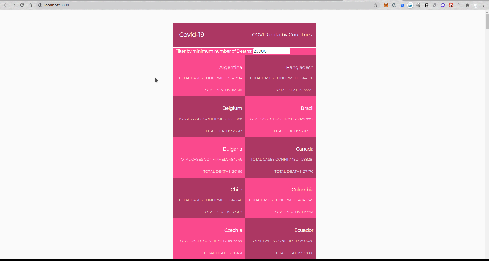

# COVID-19 Metrics Webapp

Single Page Application that fetch country data related to COVID-19 from the narrativa API and displays the metrics on a card per country.

## Built With

- JavaScript/React
- React Router
- React-redux
- Redux-logger
- CSS
- Bootstrap
- Webpack
- Babel
- Jest

## Setup

- Get the link of the repository: `https://github.com/kimothokamau/covid-metrics-capstone.git`
- Clone it as `https://github.com/kimothokamau/covid-metrics-capstone.git` on a Terminal

## Usage

- Run `npm install` on a Terminal to install the modules
- Run `npm start` on a Terminal to start the server 
- Open [http://localhost:3000](http://localhost:3000) to view it in the browser.

## Tests

- Run `npm test` on a Terminal to run the test suite

## Authors

👨‍💻 **Kevin Kamau**

- GitHub: [@kimothokamau](https://github.com/kimothokamau)
- LinkedIn: [Kevin Kamau](https://www.linkedin.com/in/kevinkamauk/)

## 🤝 Contributing

Thanks to [Nelson Sakwa on Behance](https://www.behance.net/sakwadesignstudio) for allowing me to use his theme.

Contributions, issues, and feature requests are welcome on the [issues page](https://github.com/kimothokamau/covid-metrics-capstone/issues).

## Show your support

Give a ⭐️ if you like this project!

## Acknowledgments

- Microverse
- React, Redux and React Router documentation
- Friends that I made on Microverse

## 📝 License
This project is [MIT](https://opensource.org/licenses/MIT) licensed.